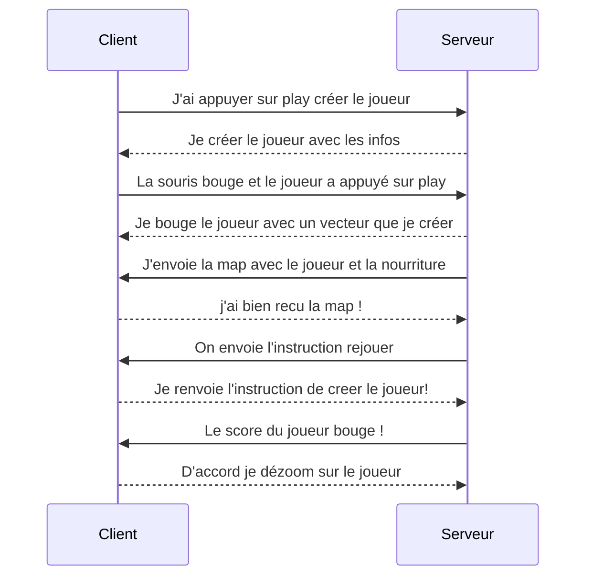

# sae-2023-groupeG-Duvauchel-Misplon

## Membres et nom du jeu

Nom du projet : Dungeon.io
Membre du groupe : Antonin Duvauchel - Benoit Misplon 

## Diagramme de séquence

## Difficultées rencontrées

Nous avons rencontrées quelques difficultées quand nous avons programmé notre jeu au moment du translate et du dézoom et adapter notre fonction de déplacement en fonction de celà.

Pour le dézoom nous voulions envoyer une instruction au client a chaque fois que le joueur mangé mais cette fonction était dans une double boucle qui était elle meme dans le set interval et le serveur n'avait donc pas le temps d'envoyer le message au client donc nous avons contourné le probleme et envoyer un message quand le sore du joueur bouge.

Pour le translate, le centrée sur le joueur n'était pas facile nous avons donc fait un schéma pour mieux comprendre comment faire les calculs.

Pour les calculs vectoriel, nous devions trouver une formule qui bride la vitesse sans compromettre sa direction j'ai donc du utiliser la trigonométrie et les vecteurs.

## Les améliorations a apporter

On pourrait ajouter plus de fonctionnalité a notre jeu pour qu'ils soient plus fun a jouer. Mais par manque de temps nous avons dus faire au plus court.On pourrait également améliorer le lore du jeu pour qu'ils soient plus original.

## Ce dont nous sommes le plus fier

Nous sommes assez fier de l'aspect global de notre code assez bine réparti et compréhensible il est assez facile d'implémenter de nouvelles fonctionnalitées dans chaque vues et même coté serveur c'est assez compréhensible. 